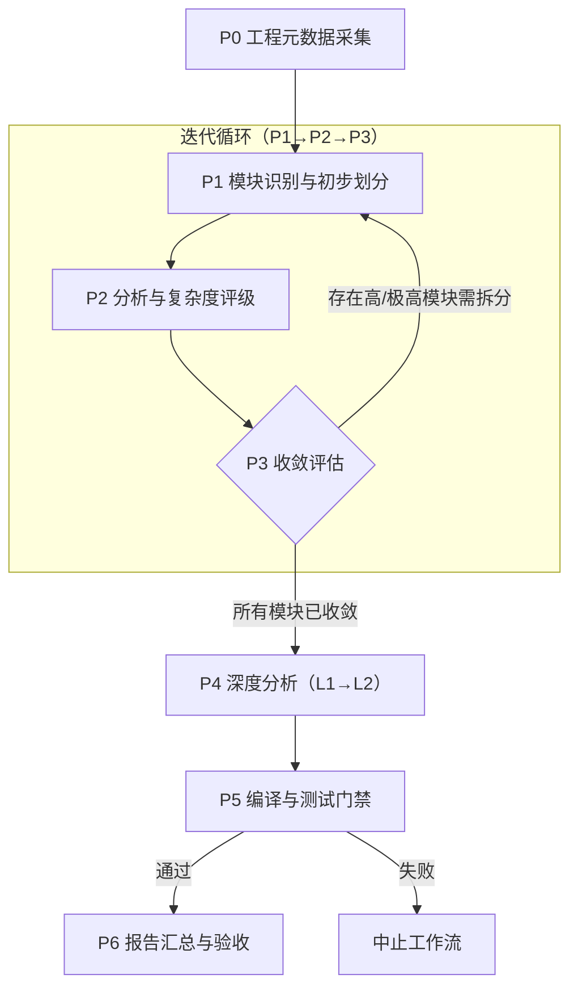
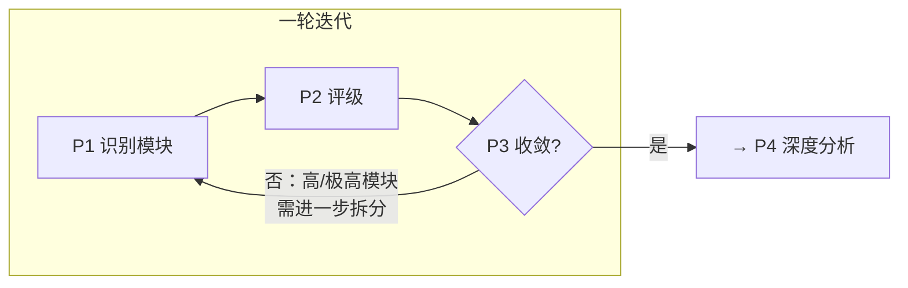

# 代码架构分析工作流 - Agent 入口

> **读取指令**：这是 Agent 执行代码架构分析的总入口。本工作流采用迭代式架构：先通过 P0→P1→P2→P3 循环确保模块划分粒度充分，再通过 P4→P5→P6 完成深度分析与验收。根据当前工程状态，选择对应路径执行。

---

## 工作流总览

**核心设计原则**：

- **关注点分离**：识别（P1）、评级（P2）、评估（P3）分离为独立步骤，降低每步的认知负载
- **证据驱动评级**：客观指标作为证据输入 + 模型结构化主观推理，取代纯机械规则
- **两级报告**：迭代阶段使用 L1 轻量报告，收敛后升级为 L2 完整报告
- **并行化**：各阶段中标注 `[可并行]` 的任务可同时执行

---

## 快速决策树

按以下顺序检查当前状态，根据第一个「否」进入对应阶段：

| 步骤 | 问题 | 否 | 是 |
| ---- | ---- | -- | -- |
| Q0 | 工程元数据是否已采集？ | 执行 [P0: 工程元数据采集](phases/00-metadata.md) | 继续 Q1 |
| Q1 | 是否已为所有目标模块生成 L1 报告？ | 执行 [P1: 模块识别](phases/01-identification.md) | 继续 Q2 |
| Q2 | 所有 L1 报告是否已包含复杂度评级？ | 执行 [P2: 分析与评级](phases/02-analysis-and-rating.md) | 继续 Q3 |
| Q3 | 模块划分是否已收敛（所有叶子模块 ≤ 中或有合格不拆理由）？ | 执行 [P3: 收敛评估](phases/03-convergence.md)，按结论决定回到 P1 或继续 | 继续 Q4 |
| Q4 | 所有模块是否已升级为 L2 完整报告？ | 执行 [P4: 深度分析](phases/04-deep-analysis.md) | 继续 Q5 |
| Q5 | 构建与测试是否已文档化且可执行？ | 执行 [P5: 编译与测试门禁](phases/05-build-and-tests.md) | 继续 Q6 |
| Q6 | 总体报告是否已汇总且引用完整？ | 执行 [P6: 报告汇总](phases/06-assembly.md) | 分析完成 |

**决策规则**：从 Q0 开始，遇到第一个「否」即进入对应阶段。全部为「是」则视为分析已完成。

---

## 判断依据

### Q0: 工程元数据是否已采集？

- [ ] `docs/codearch/engineering_metadata.md` 存在
- [ ] 包含目录结构、构建 Target、代码行数、命名空间、文档清单、测试目录

**全部满足** → Q1 | **任一不满足** → P0

### Q1: L1 报告是否已生成？

- [ ] `docs/codearch/modules/` 目录存在且包含模块报告文件
- [ ] 主要模块（≥80% 已识别模块）均有对应 `.md` 文件
- [ ] 每份报告含模块名、路径、代码规模、职责描述、依赖概览

**全部满足** → Q2 | **任一不满足** → P1

### Q2: 复杂度评级是否已完成？

- [ ] 每份 L1 报告包含「复杂度评级」章节
- [ ] 评级包含结构化推理（5 维度分析）
- [ ] 高/极高模块有拆分说明
- [ ] 总体报告包含模块依赖图

**全部满足** → Q3 | **任一不满足** → P2

### Q3: 模块划分是否已收敛？

依据 [收敛条件](definitions/convergence_criteria.md)：

- [ ] 所有叶子模块满足收敛条件（复杂度 ≤ 中，或有合格不拆理由，或已达递归上限）
- [ ] 无「待拆」或模糊表述残留
- [ ] 评级交叉验证通过（无明显偏低评级）

**全部满足** → Q4 | **任一不满足** → P3（P3 结论可能触发回到 P1）

### Q4: L2 报告是否已完成？

- [ ] 所有模块报告标记为 `报告层级: L2（完整版）`
- [ ] 每份 L2 报告包含：代码特征、关键代码位置索引、关键数据流路径、与其它模块的关系
- [ ] 涉及手动内存管理的模块含生命周期与所有权模型
- [ ] 多线程模块含并发不变量
- [ ] 每份报告含使用示例

**全部满足** → Q5 | **任一不满足** → P4

### Q5: 构建与测试是否就绪？

- [ ] `docs/codearch/build_and_tests.md` 存在
- [ ] 包含编译系统说明及构建命令
- [ ] 包含单元测试说明
- [ ] 包含「环境验证状态」章节且 build_success=true、tests_runnable=true

**全部满足** → Q6 | **任一不满足** → P5

> **硬性门禁**：P5 包含编译与测试环境验证。若工程无法编译或测试无法运行，**整个工作流中止**。

### Q6: 总体报告是否完整？

- [ ] `docs/codearch/overall_report.md` 存在
- [ ] 包含工程概览、模块索引（含依赖图与跨模块关系摘要）、构建与测试摘要
- [ ] 所有模块链接指向存在的文件

**全部满足** → 分析完成 | **任一不满足** → P6

---

## 核心文档索引

### 定义文档（按需查阅）

| 文档 | 用途 | 何时阅读 |
| ---- | ---- | -------- |
| [复杂度等级（证据驱动）](definitions/complexity_levels.md) | 模块复杂度评级的结构化推理框架 | P2 复杂度评级时 |
| [客观指标定义](definitions/objective_metrics.md) | P0/P2 采集的客观指标及触发阈值 | P0 采集、P2 评级时 |
| [收敛条件](definitions/convergence_criteria.md) | 迭代收敛判定、不拆理由格式、迭代控制 | P3 收敛评估时 |
| [验证等级](definitions/validation_levels.md) | 模块验证等级（L0–L3）及触发条件 | P4 深度分析中对高复杂度模块验证时 |
| [产出路径与报告结构](definitions/output_structure.md) | 产出路径、L1/L2 报告结构、下游使用约定 | P6 或撰写/检查报告时 |
| [C/C++ 注意点](definitions/cpp_cpp_notes.md) | 命名空间、头文件、链接、ABI 注意事项 | 模块边界与依赖分析时 |

### 阶段文档（按决策树进入）

| 阶段 | 文档 | 说明 | 并行性 |
| ---- | ---- | ---- | ------ |
| P0 | [工程元数据采集](phases/00-metadata.md) | Q0 为「否」时执行 | 各采集命令可并行 |
| P1 | [模块识别与初步划分](phases/01-identification.md) | Q1 为「否」或 P3 触发重入时执行 | 多模块扫描可并行 |
| P2 | [分析与复杂度评级](phases/02-analysis-and-rating.md) | Q2 为「否」时执行 | P2a 各模块可并行，P2b 串行 |
| P3 | [收敛评估](phases/03-convergence.md) | Q3 为「否」时执行 | — |
| P4 | [深度分析](phases/04-deep-analysis.md) | Q4 为「否」时执行 | 各模块可并行（依赖分析除外） |
| P5 | [编译与测试门禁](phases/05-build-and-tests.md) | Q5 为「否」时执行 | — |
| P6 | [报告汇总与验收](phases/06-assembly.md) | Q6 为「否」时执行 | — |

### 技能文档（按需加载）

> **注意**：不要预先阅读所有 Skill 文档，仅在阶段文档指示时加载对应 Skill。

| Skill | 名称 | 触发条件 |
| ----- | ---- | -------- |
| [Skill 00](skills/skill-00-metadata.md) | 工程元数据采集 | P0 指示 |
| [Skill 01](skills/skill-01-identify.md) | 模块识别与 L1 报告 | P1 指示 |
| [Skill 02](skills/skill-02-rate.md) | 证据驱动复杂度评级 | P2 指示 |
| [Skill 03](skills/skill-03-converge.md) | 收敛评估 | P3 指示 |
| [Skill 04](skills/skill-04-analyze.md) | 深度分析（L1→L2） | P4 指示 |
| [Skill 05](skills/skill-05-build-tests.md) | 构建与测试体系 | P5 指示 |
| [Skill 06](skills/skill-06-assemble.md) | 报告汇总与验收 | P6 指示 |

### 模板文档

| 模板 | 用途 |
| ---- | ---- |
| [工程元数据模板](templates/engineering_metadata.md) | P0 产出格式 |
| [模块报告 L1 模板](templates/module-report-L1.md) | P1/P2 迭代阶段使用 |
| [模块报告 L2 模板](templates/module-report-L2.md) | P4 深度分析产出 |
| [模块索引模板](templates/module_index.md) | 总体报告中的模块索引章节 |
| [总体报告模板](templates/overall-report.md) | 生成或更新 overall_report.md |

---

## 迭代循环说明

### P1→P2→P3 循环

- **首轮**：P1 扫描整个工程，识别顶层模块
- **后续轮**：P1 仅对 P3 识别出的高/极高模块进行子模块拆分，其余已收敛模块不重复处理
- **并行**：P3 识别出的多个需拆分模块可在 P1 中并行处理
- **上限**：最多 3 轮迭代；达到上限后强制收敛，进入 P4

### 报告层级演进

| 阶段 | 报告层级 | 内容 |
| ---- | -------- | ---- |
| P1 | L1（初始） | 模块名、路径、代码规模、职责、依赖概览 |
| P2 | L1（含评级） | + 复杂度评级（结构化推理）、拆分说明 |
| P4 | L2（完整） | + 代码特征、数据流、生命周期、并发不变量、使用示例等全部字段 |

---

## 执行原则

通用原则见 [通用执行原则](../definitions/execution_principles.md)。本阶段补充：

- **迭代与收敛**：P2 完成后必须经 P3 收敛评估；未收敛则按 [收敛条件](definitions/convergence_criteria.md) 重入 P1，直至收敛或达上限。
- **证据驱动**：复杂度评级采用客观指标 + 结构化主观推理，不使用纯机械升降档规则。详见 [复杂度等级](definitions/complexity_levels.md)。
- **分层分析**：迭代阶段只做识别与评级（L1），深度分析推迟到收敛后（P4），避免对中间模块做无用的深度分析。
- **并行优先**：各阶段中标注 `[可并行]` 的任务应尽量并行执行以提高效率。

---

## 立即开始

请根据上方决策树判断当前工程状态，然后进入对应阶段文档开始执行。分析完成后，后续 Agent 可通过总体报告中的模块索引按需加载各模块报告。
