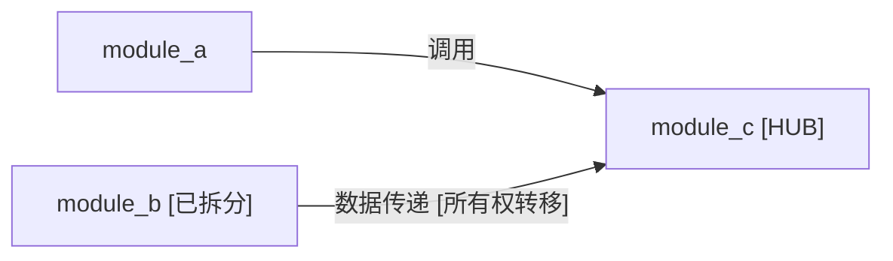

# 模块索引模板

> **用途**：用于总体报告中的模块索引章节

---

## 使用说明

本模板定义了 `overall_report.md` 中「模块索引」章节的结构。它替代了旧设计中较简单的「模块列表」，提供了更完整的模块索引视图，包括：

- **模块列表**：带状态列的表格，支持子模块拆分的层级展示
- **模块依赖图**：Mermaid 流程图，展示模块间依赖关系与特殊标注
- **跨模块关系摘要**：文字描述工程核心交互模式与架构特征

---

## 模板

```markdown
## 模块索引

### 模块列表

| 模块 | 路径/范围 | 复杂度 | 状态 | 报告链接 |
|------|---------|--------|------|---------|
| <module_a> | src/path/ | 中 | 叶子 | [链接](modules/<module_a>.md) |
| <module_b> | src/path/ | 极高（已拆分） | 已拆分 | [链接](modules/<module_b>.md) |
| ↳ <module_b>_sub1 | src/path/sub1/ | 中 | 叶子 | [链接](modules/<module_b>_sub1.md) |
| ↳ <module_b>_sub2 | src/path/sub2/ | 高 | 叶子 | [链接](modules/<module_b>_sub2.md) |

> **状态说明**: 「叶子」= 不再拆分的最终模块；「已拆分」= 已进行子模块分解，子模块以 ↳ 缩进显示

### 模块依赖图

<Mermaid flowchart showing all module dependencies>



> **依赖类型**: 调用 / 数据传递 / 事件通知 / 配置读取 / 继承
> **标注**: [HUB]=被≥3个模块依赖; [所有权转移]=跨模块资源所有权转移; [已拆分]=已分解为子模块

### 跨模块关系摘要

<2-3 段文字，描述工程的核心模块交互模式、关键数据流方向、层次架构特征>

1. **整体架构层次**: <描述模块的层次关系，如应用层→服务层→引擎层→基础层>
2. **核心数据流**: <描述主要数据从输入到输出的流转路径，涉及哪些模块>
3. **关键枢纽**: <描述枢纽模块(HUB)的角色及其被依赖的模式>
```
