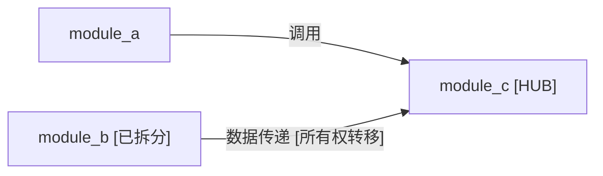

# 总体报告模板

> **用途**：生成代码架构分析的总体报告，供后续 Agent 或人工按需引用模块报告  
> **位置**：`docs/codearch/overall_report.md`

---

## 使用说明

1. P0 产出 `engineering_metadata.md` 后，可引用其中数据填充「工程概览」和「技术特征概览」的基础部分。
2. P1/P2 迭代过程中逐步填充「模块索引」，包括模块列表、依赖图和跨模块关系摘要。
3. P4 深度分析完成后补充「技术特征统计」的详细数据。
4. P5 后补充「构建与测试摘要」。
5. P6 做最终汇总，确保所有链接指向 `docs/codearch/modules/<module_name>.md` 且正确可访问。
6. 模块索引仅保留链接，不内嵌模块全文，便于按需加载。
7. 「信息来源汇总」记录分析过程中发现并利用的文档，便于追溯和后续维护。

---

## 模板

```markdown
# <工程名称> - 代码架构分析总体报告

> 分析日期: YYYY-MM-DD
> 工作流: codearch-agents
> 分析范围/版本（可选）: 仓库 commit/tag: <commit_or_tag>；分析范围: <全库或子路径，如 src/>

---

## 工程概览

### 工程目标

<一段话描述工程主要做什么>

### 输入

- <输入类型 1>: <描述>
- <输入类型 2>: <描述>

### 输出

- <输出类型 1>: <描述>
- <输出类型 2>: <描述>

### 主流程

<步骤列表或 Mermaid 流程图>

1. <步骤 1>
2. <步骤 2>
3. <步骤 3>

---

## 技术特征概览

<工程整体的技术特征统计，为下游风险分析提供全局视图>

### 语言与标准

- **主要语言**: [C / C++ / C 与 C++ 混合]
- **语言标准**: [C99 / C11 / C++11 / C++14 / C++17 / C++20 / 混合]
- **主要依赖库**: <列出主要第三方库，如 Boost、OpenSSL、gRPC 等>

### 技术特征统计

| 特征         | 涉及模块数 | 主要模块             |
| ------------ | ---------- | -------------------- |
| 手动内存管理 | <N>        | <module_a, module_b> |
| 多线程/并发  | <N>        | <module_c>           |
| 文件 I/O     | <N>        | <module_d>           |
| 网络 I/O     | <N>        | <module_e>           |
| 外部数据处理 | <N>        | <module_f>           |

### 入口点索引

| 入口类型 | 位置                          | 说明             |
| -------- | ----------------------------- | ---------------- |
| main()   | <src/main.cpp:line>           | 程序主入口       |
| 网络入口 | <src/server.cpp:line>（若有） | 网络请求处理入口 |
| 配置入口 | <src/config.cpp:line>（若有） | 配置文件解析入口 |

---

## 模块索引

### 模块列表

| 模块 | 路径/范围 | 复杂度 | 状态 | 报告链接 |
|------|---------|--------|------|---------|
| <module_a> | src/path/ | 中 | 叶子 | [链接](modules/<module_a>.md) |
| <module_b> | src/path/ | 极高（已拆分） | 已拆分 | [链接](modules/<module_b>.md) |
| ↳ <module_b>_sub1 | src/path/sub1/ | 中 | 叶子 | [链接](modules/<module_b>_sub1.md) |
| ↳ <module_b>_sub2 | src/path/sub2/ | 高 | 叶子 | [链接](modules/<module_b>_sub2.md) |

> **状态说明**: 「叶子」= 不再拆分的最终模块；「已拆分」= 已进行子模块分解，子模块以 ↳ 缩进显示

### 模块依赖图

<Mermaid flowchart showing all module dependencies>



> **依赖类型**: 调用 / 数据传递 / 事件通知 / 配置读取 / 继承
> **标注**: [HUB]=被≥3个模块依赖; [所有权转移]=跨模块资源所有权转移; [已拆分]=已分解为子模块

### 跨模块关系摘要

<2-3 段文字，描述工程的核心模块交互模式、关键数据流方向、层次架构特征>

1. **整体架构层次**: <描述模块的层次关系，如应用层→服务层→引擎层→基础层>
2. **核心数据流**: <描述主要数据从输入到输出的流转路径，涉及哪些模块>
3. **关键枢纽**: <描述枢纽模块(HUB)的角色及其被依赖的模式>

---

## 构建与测试摘要

<简要说明或链接到 build_and_tests.md>

参见 [构建与测试说明](build_and_tests.md)。

---

## 信息来源汇总

<记录分析过程中发现并利用的文档和信息源>

| 类型       | 文件/目录               | 用于               |
| ---------- | ----------------------- | ------------------ |
| 项目文档   | README.md               | 工程目标、主流程   |
| 设计文档   | docs/design.md（若有）  | 架构说明           |
| 贡献指南   | CONTRIBUTING.md（若有） | 目录结构、构建说明 |
| 示例目录   | examples/（若有）       | 使用示例提取       |
| 测试目录   | test/ 或 tests/         | 功能边界、示例代码 |
| 头文件注释 | src/*_/_.h              | API 说明、模块注释 |

**文档质量评估**（可选）：

- 项目文档完善度：[完善 / 一般 / 不足]
- 测试覆盖情况：[充分 / 部分 / 缺乏]
- 注释质量：[详细 / 一般 / 稀少]

---

## 后续分析建议（可选）

<对深度代码审查、写测试等的建议>
```

---

## 与 output_structure 的对应

- 路径、章节要求见 [产出路径与报告结构约定](../definitions/output_structure.md)。
- **可选**：可在文档头部使用 YAML frontmatter，字段如 `summary`、`scope_commit`、`module_count`，供 Agent 做轻量解析或 embedding。
