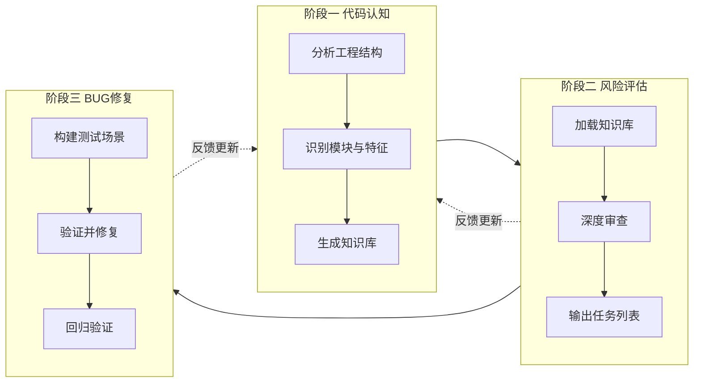

# Agentic Code Assurance：自动化 BUG 分析端到端工作流

> **读取指令**：本文档是 Agent（如 OpenCode、ClaudeCode）执行自动化 BUG 分析的总入口。先阅读本文档以理解整条流水线、各阶段输入输出与反馈机制，再根据当前目标进入对应子目录的 Workflow.md。

---

## 一、总览与阅读顺序

### 用途

本目录定义面向 **C/C++ 工程** 的「自动化 BUG 分析」端到端工作流，供 Agent 按阶段执行：先建立工程知识库，再识别潜在 BUG，最后验证并修复。

### 阅读顺序

1. **先读本文档（本 Workflow）**，确认三阶段顺序、输入输出契约与反馈机制。
2. **根据当前目标与前置产出状态**，进入对应子目录的 **Workflow.md**：
   - 需要建立或更新工程知识库 → [1-code-cognition/Workflow.md](1-code-cognition/Workflow.md)
   - 知识库已就绪、需识别潜在 BUG → [2-risk-assessment/Workflow.md](2-risk-assessment/Workflow.md)
   - 已有疑似 BUG 任务列表、需验证与修复 → [3-bug-remediation/Workflow.md](3-bug-remediation/Workflow.md)

---

## 二、端到端编排

### 三阶段顺序

- **阶段一（代码认知）** → **阶段二（风险评估）** → **阶段三（BUG 修复）**；通常按顺序执行。
- 阶段二、三可根据前置产出是否已存在，决定跳过或重跑。

### 何时进入下一阶段

| 欲进入阶段 | 前置条件                                                                                                                                                           |
| ---------- | ------------------------------------------------------------------------------------------------------------------------------------------------------------------ |
| 阶段二     | `docs/codearch/overall_report.md` 存在，且满足 [1-code-cognition/Workflow.md](1-code-cognition/Workflow.md) 中 Q1 ～ Q3 的「是」条件（即代码认知已完成或已更新）。 |
| 阶段三     | 阶段二产出已存在：`docs/risk_tasks/` 下存在任务列表（具体文件名见 [2-risk-assessment/Workflow.md](2-risk-assessment/Workflow.md)）。                               |

---

## 三、各阶段输入输出（契约）

| 阶段           | 输入                                                  | 输出（路径与形式）                                                                                                                                                                                   |
| -------------- | ----------------------------------------------------- | ---------------------------------------------------------------------------------------------------------------------------------------------------------------------------------------------------- |
| **1 代码认知** | 源代码、构建配置                                      | `docs/codearch/`：`overall_report.md`、`modules/<module_name>.md`、`build_and_tests.md`。详见 [1-code-cognition/definitions/output_structure.md](1-code-cognition/definitions/output_structure.md)。 |
| **2 风险评估** | 知识库（`docs/codearch/`）+ 源代码                    | 疑似 BUG 任务列表：`docs/risk_tasks/`。具体文件名与格式由 [2-risk-assessment/Workflow.md](2-risk-assessment/Workflow.md) 约定。                                                                      |
| **3 BUG 修复** | 任务列表 + 源代码 + `docs/codearch/`（构建/测试说明） | 测试用例（落入工程测试目录）、修复补丁或变更说明；可选 `docs/remediation/` 记录摘要。具体由 [3-bug-remediation/Workflow.md](3-bug-remediation/Workflow.md) 约定。                                    |

---

## 四、反馈机制（如何更新阶段一）

阶段二或阶段三执行过程中，若发现**工程理解文档与代码不一致或遗漏**，应触发反馈，更新知识库以保持与代码一致。

### 操作约定

| 发现类型                | 更新方式                                                                                                                                                                                       |
| ----------------------- | ---------------------------------------------------------------------------------------------------------------------------------------------------------------------------------------------- |
| 模块职责/边界描述不准确 | 直接更新 `docs/codearch/modules/<module_name>.md` 的职责描述、边界等对应章节。                                                                                                                 |
| 遗漏外部依赖或代码特征  | 补充该模块报告中的「依赖」「代码特征」等章节。                                                                                                                                                 |
| 模块边界划分不合理      | 在 1-code-cognition 中触发「分解审视」，并视结果重跑 Phase 01 或 Phase 02。详见 [1-code-cognition/definitions/decomposition_review.md](1-code-cognition/definitions/decomposition_review.md)。 |

### 记录建议

可在 `docs/codearch/` 下使用可选文件（如 `knowledge_base_changelog.md`）记录反馈类型与修改摘要，便于审计。格式不强制，由后续工作流或人工约定。

---

## 五、目录说明

| 目录                   | 说明                                                                                                                                               |
| ---------------------- | -------------------------------------------------------------------------------------------------------------------------------------------------- |
| **本目录**             | 总入口：本文档（Workflow.md）。端到端编排、契约与反馈机制见上文。                                                                                  |
| **1-code-cognition/**  | 代码架构与工程理解工作流（完整）。入口：[Workflow.md](1-code-cognition/Workflow.md)。产出即 `docs/codearch/` 下的知识库。                          |
| **2-risk-assessment/** | 风险分析工作流。入口：[Workflow.md](2-risk-assessment/Workflow.md)。输入：`docs/codearch/`；输出：疑似 BUG 任务列表。                              |
| **3-bug-remediation/** | BUG 确认与修复工作流。入口：[Workflow.md](3-bug-remediation/Workflow.md)。输入：任务列表与知识库；输出：测试、修复与 docs/remediation/ 摘要。      |

---

## 立即开始

请根据当前目标与上表「何时进入下一阶段」判断应执行的阶段，然后打开对应目录下的 **Workflow.md** 开始执行。
