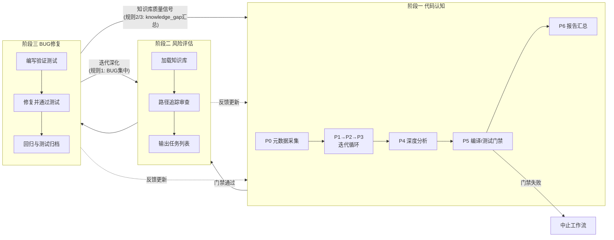

# Agentic Code Assurance：自动化 BUG 分析端到端工作流

> **读取指令**：本文档是 Agent（如 OpenCode、ClaudeCode）执行自动化 BUG 分析的总入口。先阅读本文档以理解整条流水线、各阶段输入输出与反馈机制，再根据当前目标进入对应子目录的 Workflow.md。

> **路径约定**：本工作流所有文档中的链接路径均以 `agentic-code-assurance/` 目录为根基准。例如 `1-code-cognition/Workflow.md` 指向 `agentic-code-assurance/1-code-cognition/Workflow.md`。同一子目录内的引用使用相对路径（如 `../skills/skill-00-metadata.md`）；跨子目录的引用从本目录根开始（如 `1-code-cognition/definitions/convergence_criteria.md`）。

---

## 一、总览与阅读顺序

### 用途

本目录定义面向 **C/C++ 工程** 的「自动化 BUG 分析」端到端工作流，供 Agent 按阶段执行：先建立工程知识库，再识别潜在 BUG，最后验证并修复。

### 阅读顺序

1. **先读本文档（本 Workflow）**，确认三阶段顺序、输入输出契约与反馈机制。阶段一又称**代码认知**（即工程理解），阶段二又称**风险评估**（即风险分析），阶段三又称**BUG 修复**（即确认与修复）。
2. **根据当前目标与前置产出状态**，进入对应子目录的 **Workflow.md**：
   - 需要建立或更新工程知识库 → [1-code-cognition/Workflow.md](1-code-cognition/Workflow.md)
   - 知识库已就绪、需识别潜在 BUG → [2-risk-assessment/Workflow.md](2-risk-assessment/Workflow.md)
   - 已有疑似 BUG 任务列表、需验证与修复 → [3-bug-remediation/Workflow.md](3-bug-remediation/Workflow.md)

---

## 二、端到端编排

### 三阶段顺序

```mermaid
flowchart LR
    subgraph stage1 [阶段一 代码认知]
        direction TB
        A0["P0 元数据采集"]
        A1["P1→P2→P3\n迭代循环"]
        A4["P4 深度分析"]
        A5["P5 编译/测试门禁"]
        A6["P6 报告汇总"]
        A0 --> A1 --> A4 --> A5 --> A6
    end
    subgraph stage2 [阶段二 风险评估]
        B1[加载知识库]
        B2[路径追踪审查]
        B3[输出任务列表]
        B1 --> B2 --> B3
    end
    subgraph stage3 [阶段三 BUG修复]
        C1[编写验证测试]
        C2[修复并通过测试]
        C3[回归与测试归档]
        C1 --> C2 --> C3
    end
    stage1 -->|门禁通过| stage2 --> stage3
    stage3 -->|"迭代深化\n(规则1: BUG集中)"| stage2
    stage3 -->|"知识库质量信号\n(规则2/3: knowledge_gap汇总)"| stage1
    stage2 -.->|反馈更新| stage1
    stage3 -.->|反馈更新| stage1
    A5 -->|门禁失败| ABORT[中止工作流]
```

- **阶段一（代码认知）** → **阶段二（风险评估）** → **阶段三（BUG 修复）**；通常按顺序执行。
- 阶段一采用**迭代式架构**：P0 元数据采集 → P1/P2/P3 迭代循环（确保模块粒度充分）→ P4 深度分析 → P5 编译与测试门禁 → P6 报告汇总。
- 阶段一 P5 包含**编译与测试环境硬性门禁**：若工程无法编译或测试无法运行，工作流在此中止。
- 阶段二、三可根据前置产出是否已存在，决定跳过或重跑。
- 阶段三完成后，可通过**迭代深化机制**重新进入阶段二进行更深层的分析（见第五节）。

### 何时进入下一阶段

| 欲进入阶段 | 前置条件                                                                                                                                                                                                                                                                                     |
| ---------- | -------------------------------------------------------------------------------------------------------------------------------------------------------------------------------------------------------------------------------------------------------------------------------------------- |
| 阶段二     | `docs/codearch/overall_report.md` 存在，且满足 [1-code-cognition/Workflow.md](1-code-cognition/Workflow.md) 中 Q0 ～ Q6 全部「是」（即代码认知阶段 P0–P6 均已完成）。**特别注意**：阶段一 P5 包含编译与测试环境硬性门禁，若工程无法编译或测试无法运行，工作流将在此中止，不会进入阶段二。 |
| 阶段三     | 阶段二产出已存在：`docs/risk_tasks/` 下存在任务列表（具体文件名见 [2-risk-assessment/Workflow.md](2-risk-assessment/Workflow.md)）。                                                                                                                                                         |

---

## 三、各阶段输入输出（契约）

| 阶段           | 输入                                                  | 输出（路径与形式）                                                                                                                                                                                                      |
| -------------- | ----------------------------------------------------- | ----------------------------------------------------------------------------------------------------------------------------------------------------------------------------------------------------------------------- |
| **1 代码认知** | 源代码、构建配置                                      | `docs/codearch/`：`overall_report.md`、`modules/<module_name>.md`、`build_and_tests.md`。详见 [1-code-cognition/definitions/output_structure.md](1-code-cognition/definitions/output_structure.md)。                    |
| **2 风险评估** | 知识库（`docs/codearch/`）+ 源代码                    | 疑似 BUG 任务列表：`docs/risk_tasks/`。具体文件名与格式由 [2-risk-assessment/Workflow.md](2-risk-assessment/Workflow.md) 约定。                                                                                         |
| **3 BUG 修复** | 任务列表 + 源代码 + `docs/codearch/`（构建/测试说明） | 验证测试（集成到正式测试套件）、源码修复（当前分支直接修改）、`docs/remediation/remediation_log.md`（完整记录）。可通过 git diff 审查修复。具体由 [3-bug-remediation/Workflow.md](3-bug-remediation/Workflow.md) 约定。 |

---

## 四、反馈机制（如何更新阶段一）

阶段二或阶段三执行过程中，若发现工程理解文档与代码不一致或遗漏，应触发反馈更新知识库。完整的操作约定、操作顺序与记录建议见 [反馈操作约定](definitions/feedback_protocol.md)。

阶段二 Phase 03 和阶段三 Phase 03 完成后，还须执行**知识库质量信号汇总**（见 [反馈操作约定 - 知识库质量信号汇总](definitions/feedback_protocol.md)）：扫描当轮 `task_list.md` 和 `remediation_log.md` 中的 `knowledge_gap` 字段，按规则 A/B/C 判断是否需要补强阶段一，并将结论写入 `docs/codearch/knowledge_base_changelog.md`。迭代深化时依据此 changelog 决定是否先进入阶段一补强再开启下一轮审查。

---

## 五、迭代深化机制

阶段三完成后，可选择重新进入阶段二进行更深层的分析。迭代深化通过逐轮缩小范围、加大深度来提高发现真实 BUG 的概率。

### 迭代轮次

| 轮次                | 策略           | 范围                                             | 审查深度 | 产出文件命名                               |
| ------------------- | -------------- | ------------------------------------------------ | -------- | ------------------------------------------ |
| Round 1（广度优先） | 全模块快速扫描 | 所有模块                                         | L0-L1    | `task_list.md`、`remediation_log.md`       |
| Round 2（深度优先） | 聚焦高风险区域 | 仅 Round 1 中发现已确认 BUG 或高风险暂缓项的模块 | L2-L3    | `task_list_r2.md`、`remediation_log_r2.md` |
| Round 3（针对性）   | 跨模块交互验证 | Round 1/2 中已确认 BUG 区域的跨模块交互          | L3       | `task_list_r3.md`、`remediation_log_r3.md` |

### 迭代规则

1. **迭代入口**：阶段三完成后，检查 `remediation_log.md` 和 `docs/codearch/knowledge_base_changelog.md`。满足以下任一规则时建议启动 Round 2：

   - **规则 1（原有）**：存在「暂缓」项，或 Round 1 的已确认 BUG 集中在特定模块。
   - **规则 2（新增，知识库补强）**：`knowledge_base_changelog.md` 中标记了「知识库待补强」模块（即 [反馈操作约定](definitions/feedback_protocol.md) 规则 A 触发）。此时须先进入阶段一，执行 `Skill 04`（深度分析）补充该模块的 L2 报告，再进入 Round 2 阶段二。
   - **规则 3（新增，分解审视重开）**：`knowledge_base_changelog.md` 中标记了「分解审视待重开」（即 [反馈操作约定](definitions/feedback_protocol.md) 规则 B 触发）。此时须先进入阶段一执行 `Skill 03`（收敛评估），根据评估结论决定是否需要重入 P1 进行进一步分解，完成后再进入 Round 2 阶段二。**此触发不受阶段一原有迭代轮次上限的一次性限制**。

2. **范围缩窄**：每轮迭代的分析范围应当缩窄（更少的模块），但审查深度加大（更细致的路径追踪）。
3. **产出版本化**：每轮的 `task_list` 和 `remediation_log` 使用后缀区分（如 `_r2`、`_r3`），避免覆盖前一轮的记录。
4. **收敛条件**：当某一轮的 task_list 为空（无新发现）或全部为「未复现」时，迭代自然终止。
5. **最大轮次**：建议不超过 3 轮。超过 3 轮仍有大量新发现，可能说明阶段一的知识库质量不足，应先返回阶段一补充。
6. **知识库优先**：若规则 2 或规则 3 触发，Round N 阶段二开始前须先完成阶段一补强或分解审视，并在 `scope.md` 中注明「本轮已补强模块：XXX」或「本轮已重开分解审视」，保证审查所依赖的知识库质量已提升。

### 迭代时的阶段二入口

迭代 Round 2+ 时，进入阶段二后：

- **Phase 01（范围与策略）**：在 `scope.md` 中注明「Round N 迭代，聚焦模块：XXX」，范围为上一轮发现问题的模块。
- **Phase 02（深度审查）**：使用更高的审查深度等级（L2/L3），重点审查上一轮暂缓项和已确认 BUG 的周边代码。

---

## 六、目录说明

| 目录                   | 说明                                                                                                                                          |
| ---------------------- | --------------------------------------------------------------------------------------------------------------------------------------------- |
| **本目录**             | 总入口：本文档（Workflow.md）。端到端编排、契约与反馈机制见上文。                                                                             |
| **1-code-cognition/**  | 代码架构与工程理解工作流（完整）。入口：[Workflow.md](1-code-cognition/Workflow.md)。产出即 `docs/codearch/` 下的知识库。                     |
| **2-risk-assessment/** | 风险分析工作流。入口：[Workflow.md](2-risk-assessment/Workflow.md)。输入：`docs/codearch/`；输出：疑似 BUG 任务列表。                         |
| **3-bug-remediation/** | BUG 确认与修复工作流。入口：[Workflow.md](3-bug-remediation/Workflow.md)。输入：任务列表与知识库；输出：测试、修复与 docs/remediation/ 摘要。 |

---

## 立即开始

请根据当前目标与上表「何时进入下一阶段」判断应执行的阶段，然后打开对应目录下的 **Workflow.md** 开始执行。
