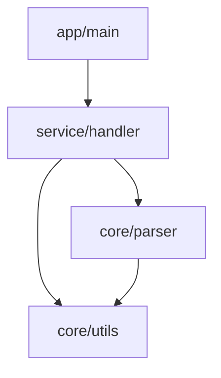

# Skill 02: 工程深度分析与模块地图

> **触发条件**：Phase 02 指示  
> **目标**：形成可被后续任务引用的工程结构认知与依赖图

---

## 输入

- 通过 Skill 01 验收的工程
- 可编译的代码库

---

## 输出

| 产出 | 路径 | 必须 |
|------|------|------|
| 模块地图 | `docs/architecture/module_map.md` | ✓ |
| 构建入口文档 | `docs/build/build_entrypoints.md` | ✓ |
| 详细依赖图 | `docs/architecture/dependencies.md` | 推荐 |

---

## 核心任务

### 任务 1: 识别模块与层次

**目标**：列出所有模块及其分类

**步骤**：

1. **分析目录结构**：通常每个顶级目录是一个模块，或根据构建配置识别模块边界
2. **识别模块类型**：库（被其他模块依赖）、服务（独立运行）、驱动（硬件接口）、工具（命令行工具）、第三方（外部依赖）、接口层（API 定义）
3. **记录每个模块的基本信息**：名称、路径、类型、一句话职责

**分析命令参考**：

```bash
# 查看目录结构
find . -type d -maxdepth 2 | grep -v '\./\.' | sort

# 查看构建目标
# CMake
grep -r "add_library\|add_executable" . --include="CMakeLists.txt"

# Bazel
grep -r "cc_library\|cc_binary" . --include="BUILD*"

# Makefile
grep "^[a-zA-Z_]*:" Makefile | head -20
```

### 任务 2: 解析依赖方向

**目标**：建立模块间依赖关系图

**步骤**：

1. **分析 include 依赖**：哪些模块 include 了哪些头文件，头文件属于哪个模块
2. **分析链接依赖**：库之间的链接关系，查看构建配置中的 target_link_libraries 等
3. **分析运行时依赖**：动态加载、配置文件、外部服务
4. **绘制依赖方向**：A → B 表示 A 依赖 B，标注依赖类型

**分析命令参考**：

```bash
# 分析 include 依赖
grep -r "#include" src/ | \
  sed 's/.*#include [<"]\(.*\)[>"]/\1/' | \
  sort | uniq -c | sort -rn

# 查看链接依赖（CMake）
grep -r "target_link_libraries" . --include="CMakeLists.txt"

# 使用 compile_commands.json 分析
# 工具：include-what-you-use, clang-tidy
```

### 任务 3: 构建体系剖析

**目标**：理解并文档化构建系统

**步骤**：

1. **识别主要构建目标**：可执行文件、静态库/动态库、测试目标
2. **分析构建配置**：编译选项、宏定义、条件编译
3. **识别平台差异**：跨平台支持情况、平台特定代码
4. **记录构建命令**：不同配置的构建方式（Debug/Release、不同平台）

### 任务 4: 识别外部依赖类型

**目标**：为每个模块标注影响可测试性的依赖

**依赖类型检查清单**：

| 类型 | 检查方法 | 风险等级 |
|------|----------|----------|
| I/O | 查找 fopen/read/write/socket | 中 |
| 网络 | 查找 connect/send/recv/http | 高 |
| 时间 | 查找 time/clock/sleep/usleep | 中 |
| 随机 | 查找 rand/random/mt19937 | 低-中 |
| 线程 | 查找 pthread/thread/mutex | 高 |
| 全局状态 | 查找 static/extern/singleton | 高 |
| 硬件 SDK | 查找特定硬件库调用 | 极高 |

**分析命令**：

```bash
# 查找 I/O 操作
grep -rn "fopen\|fread\|fwrite\|open\|read\|write" src/

# 查找网络操作
grep -rn "socket\|connect\|send\|recv\|curl" src/

# 查找时间操作
grep -rn "time\|clock\|sleep\|usleep" src/

# 查找线程操作
grep -rn "pthread\|std::thread\|mutex\|lock" src/

# 查找全局状态
grep -rn "^static \|extern \|::instance()" src/
```

---

## 输出格式

### 模块地图文档模板

```markdown
# 模块地图

## 概述
- 工程名称：xxx
- 分析日期：YYYY-MM-DD
- 模块总数：N

## 模块层次

### 核心层
（最底层，被其他层依赖）

#### 模块：core/utils
- **职责**：通用工具函数
- **类型**：库
- **路径**：src/core/utils/
- **边界**：
  - 输入：原始数据
  - 输出：处理后数据
- **依赖**：
  - 内部：无
  - 外部：无
- **风险标注**：无
- **测试建议**：L1

（继续其他模块...）

### 中间层
（依赖核心层，被上层依赖）

### 应用层
（最上层，依赖中间层）

## 依赖关系图



## 外部依赖汇总

| 模块 | I/O | 网络 | 时间 | 线程 | 全局 | 硬件 |
|------|-----|------|------|------|------|------|
| core/utils | - | - | - | - | - | - |
| io/file | ✓ | - | - | - | - | - |
| net/http | - | ✓ | ✓ | ✓ | - | - |
```

---

## 验收标准

### 必须满足

- [ ] 模块地图文档存在且内容完整
- [ ] 覆盖至少 80% 主要模块
- [ ] 每个模块有：职责、边界、依赖类型
- [ ] 构建入口文档存在

### 验收检查

```bash
# 文档存在检查
[ -f docs/architecture/module_map.md ] && echo "PASS" || echo "FAIL"
[ -f docs/build/build_entrypoints.md ] && echo "PASS" || echo "FAIL"

# 内容完整性检查（人工）
# - 打开文档检查模块覆盖率
# - 检查每个模块是否有完整描述
```

---

## 应该做

- ✓ 尽可能使用自动化工具分析
- ✓ 结合代码阅读验证分析结果
- ✓ 标注不确定的地方
- ✓ 记录分析过程中发现的问题

## 不应该做

- ✗ 凭猜测填写模块信息
- ✗ 跳过外部依赖分析
- ✗ 忽略条件编译的分支
- ✗ 过度追求完美（80% 覆盖率即可）

---

## 状态跳转

| 验收结果 | 下一步 |
|----------|--------|
| 通过 | 返回 [Phase 02](../phases/02-analysis.md) 完成验收，然后进入 [Phase 03](../phases/03-prioritization.md) |
| 未通过 - 模块遗漏 | 继续任务 1 |
| 未通过 - 依赖不清 | 继续任务 2 |
| 未通过 - 外部依赖未标注 | 继续任务 4 |

---

## 时间预估

| 工程规模 | 预估时间 |
|----------|----------|
| 小型（<10 模块） | 1 - 2 小时 |
| 中型（10-50 模块） | 2 - 4 小时 |
| 大型（>50 模块） | 4 - 8 小时 |

---

**完成后**：返回 [Phase 02](../phases/02-analysis.md) 进行阶段验收
